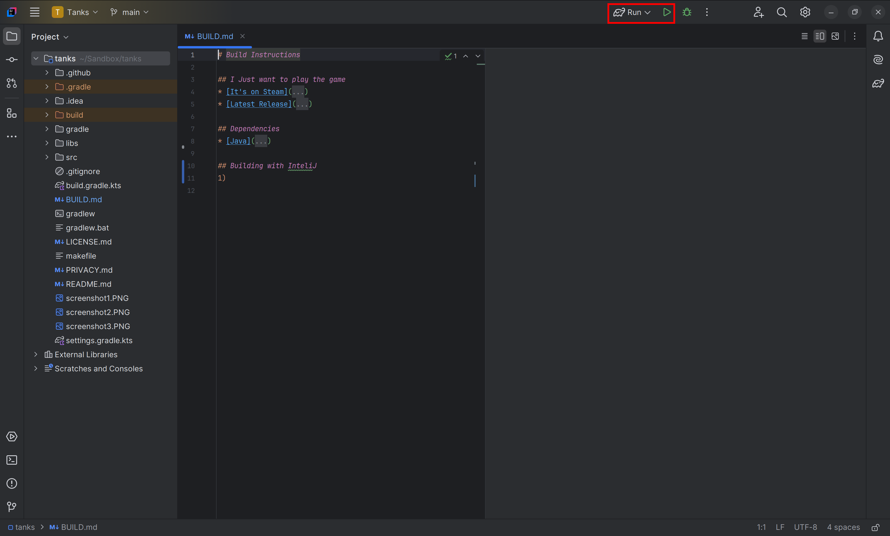

# Build Instructions

## I Just want to play the game
* [It's on Steam](https://store.steampowered.com/app/1660910/Tanks_The_Crusades/)
* [Latest Release](https://github.com/aehmttw/tanks/releases)

## Dependencies
* [Java](https://www.java.com/en/)
* [Git](https://git-scm.com/)

## Clone the Repo:
In a directory of your choice run `git clone https://github.com/aehmttw/tanks.git`

## Building with InteliJ
Open the Tanks directory created by the clone command in InteliJ

Make sure the Run Action is selected and hit the play button.

A Build Action is also available in the menu.

## Building on MacOS/Linux/Windows
Within the Tanks directory created by the clone command run one of the following commands:

Build: `./gradlew clean build`

Run: `./gradlew clean build run`