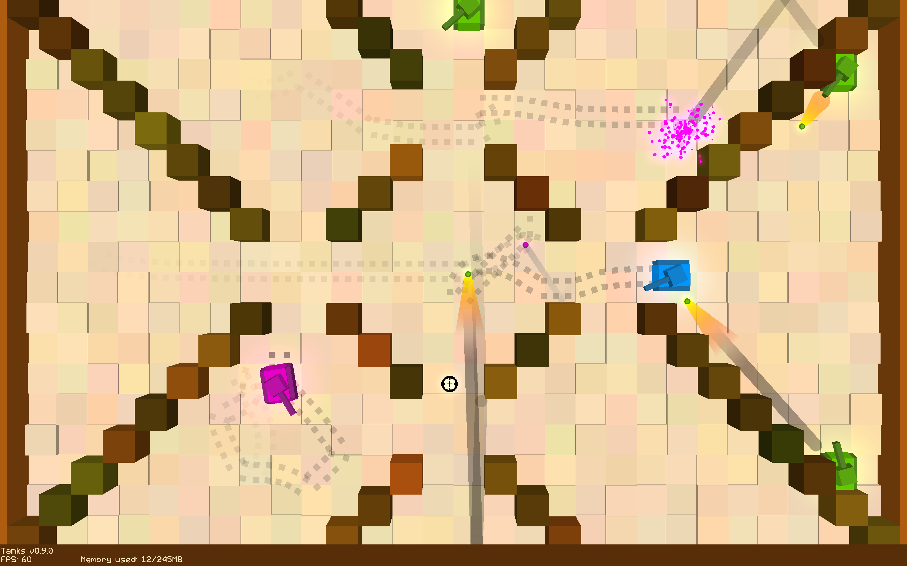
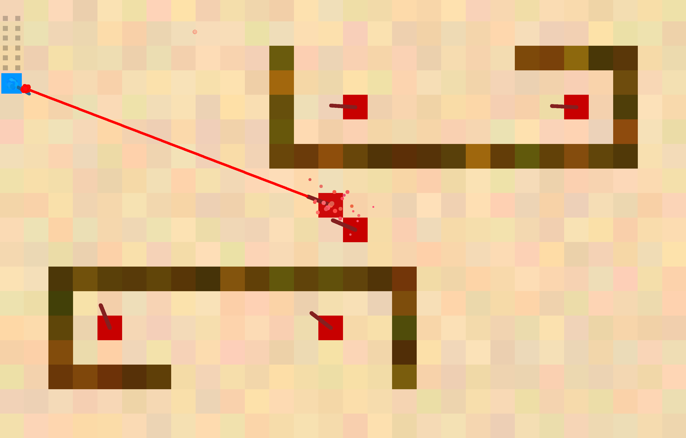
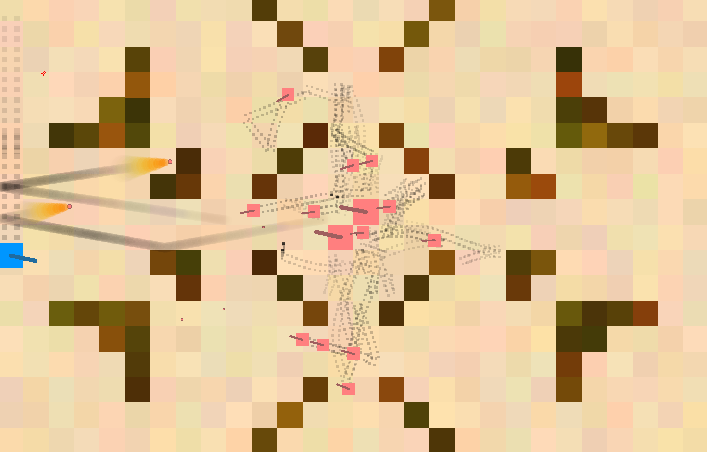

# Tanks: The Crusades

Tanks: The Crusades is a game written in Java inspired by Wii Play's Tanks. 
There are over 20 unique enemies you can fight, but you can add more of your own too. 
The game supports Windows, Mac and Linux. 
Tanks can be found on [Steam](https://store.steampowered.com/app/1660910/Tanks_The_Crusades/), [itch.io](https://aehmttw.itch.io/tanks), and the [iOS App Store](https://apps.apple.com/us/app/tanks-the-crusades/id1508772262)

## How to play

### Controls:  
Use the arrow keys or WASD to move  
Left click or click space to shoot 
Right click or press enter to lay a mine 
Press escape to pause the game 

### Level Editor controls: 
Left click to place 
Right click on an object to destroy it 
Right click on nothing to rotate the object you are placing 
Press up and down arrow keys or scroll to cycle enemy tanks 
Press left and right arrow keys to cycle enemy tank, obstacle, player tank 
Press space to access the object menu 
Press escape to change level settings 
Press enter to play your level 

The following are three screenshots of the game in action. The user controls the azure blue tank using the mouse or keyboard.

## Installation

To use the game you need to install Java. For this purpose you may need
administrator privileges to install software on your machine. You can install Java 
from [java.com](https://java.com/download). The minimum Java version is Java 8. 

You can download the [jar file](https://1drv.ms/u/s!AnwBrt306BrJ-ltbmsJuG2pZdfVk?e=fg7P0k) for Tanks.
To run the jar file you can double-click on it. 

## Development

To develop the game we suggest using Eclipse or IntelliJ. Eclipse can be installed from 
[eclipse.org](http://www.eclipse.org/downloads/). IntelliJ can be installed from 
[jetbrains.com](https://www.jetbrains.com/idea/download/).  

To access the source code you also need to install Git. 

You will need to add the following libraries to the build path of the project:  
PNGDecoder by Matthias Mann in TWL 
Netty 
All the jars and natives of the following LWJGL libraries: 
LWJGL (core) 
OpenGL 
OpenAL 
GLFW 
Assimp 
STB 
Commons IO 
Steamworks4j 

You can all download these libraries in zip format from [here](https://1drv.ms/f/s!AnwBrt306BrJgdAz1AzDfZuq79f8VQ?e=hemiis).

Please note - Tanks uses a custom version of Steamworks4j compiled with Mac OS arm64 natives. 
We recommend you use the libraries linked above, because they contain that modified Steamworks4j library. 

## Credits:

### Main Developer:
Matei Budiu (Aehmttw) 

### Code Contributors:
Karan Gurazada 
Hallowizer 
Grify 
Mihai Budiu 
Panadero1 
Arkar Tan 
Pythonmcpi 
Cool TM 
QazCetelic 
Lancelot 

### Supporters:
SapphireDrew 

### Special Thanks:
Everyone from the [Tanks Discord](https://discord.gg/aWPaJD3) who helped with ideas and bugs!
